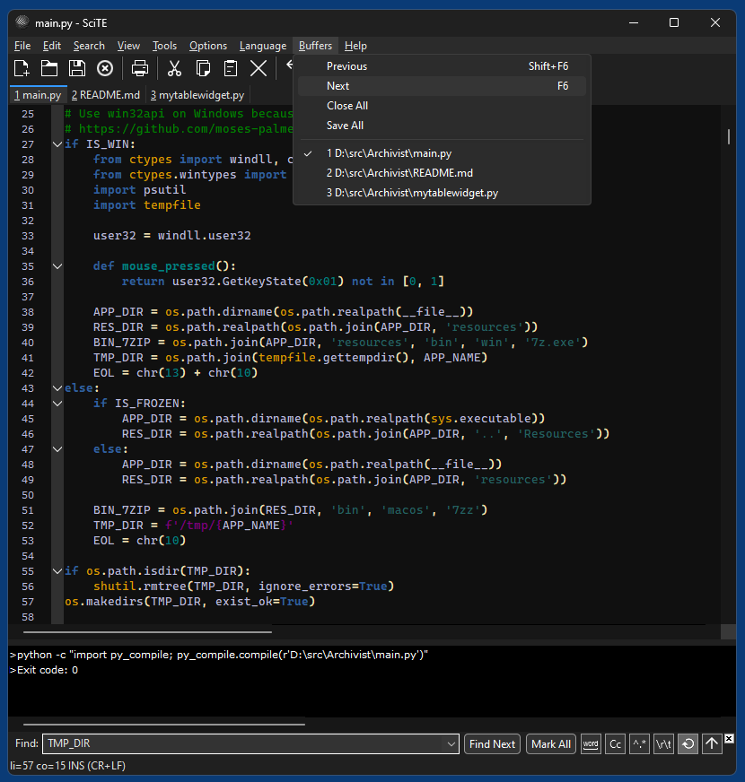

# Dark SciTE for Windows 10/11

Dark mode hacked into [SciTE](https://www.scintilla.org/SciTE.html) v5.5.2 for Windows

## Requirements

* Visual Studio 2022

## Notes

The repository only contains the (slightly rearranged) SciTE code, not the Lexilla and Scintilla code.
Instead pre-compiled Lexilla and Scintilla DLLs are provided for x64, Win32  and ARM64.

This project is about dark mode for the application's GUI, not about dark styles inside the editor. But for convenience also some simple dark style is provided as [SciTEDark.properties](properties/SciTEDark.properties) and activated by default, please edit this file to fit your needs or replace it with a more sophisticate dark style of your choice.

## Screenshots

*Dark SciTE in Windows 11*  

